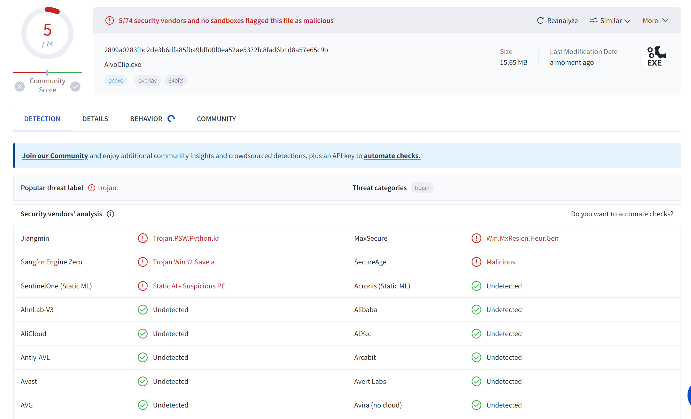

#  AivoClip

Copyright (c) 2024 led-mirage

## 概要

クリップボードに貼り付けられたテキストを A.I.VOICE で読み上げるアプリです。

[VoivoClip](https://github.com/led-mirage/VoivoClip) の A.I.VOICE 版です。

## スクリーンショット


https://github.com/led-mirage/AivoClip/assets/139528700/afeaf908-8bdd-4d31-b873-6473affa555d

## 機能

- クリップボード監視の開始と停止
- キャラクター選択
- リピート
- 設定値の自動保存

## 動作確認環境

- Windows 11 Pro 23H2
- Python 3.12.0
- A.I.VOICE Editor 1.4.9.0

## 実行方法

### 🛩️ 実行ファイル（EXE）を使う場合

#### 1. プロジェクト用のフォルダの作成

任意の場所にプロジェクト用のフォルダを作成してください。

#### 2. アプリのダウンロード

以下のリンクから AivoClip.ZIP をダウンロードして、作成したフォルダに展開してください。

https://github.com/led-mirage/AivoClip/releases/tag/v0.3.2

#### 3. 実行

A.I.VOICEを起動してから AivoClip.exe または AivoClipNC.exe をダブルクリックすればアプリが起動します。  
AivoClip.exe はコンソールも一緒に起動するバージョンで、AivoClipNC.exe はコンソールが起動しないバージョンです。  
※A.I.VOICEが起動していない状態でアプリを開始すると、自動的にA.I.VOICEを起動しようと試みます。

### 🛩️ Pythonで実行する場合

#### 1. プロジェクト用のフォルダの作成

任意の場所にプロジェクト用のフォルダを作成してください。

#### 2. ターミナルの起動

ターミナルかコマンドプロンプトを起動して、作成したプロジェクトフォルダに移動します。

#### 3. ソースファイルのダウンロード

ZIPファイルをダウンロードして作成したフォルダに展開してください。  
または、Gitが使える方は以下のコマンドを実行してクローンしてもOKです。

```bash
git clone https://github.com/led-mirage/AivoClip.git
```

#### 4. ライブラリのインストール

以下のコマンドを実行して必要なライブラリをインストールします。

```bash
pip install -r requirements.txt
```

#### 5. 実行

A.I.VOICE を起動したのち、以下のコマンドを実行するとアプリが起動します。  
※A.I.VOICEが起動していない状態でアプリを開始すると、自動的にA.I.VOICEを起動しようと試みます。

```bash
python application.py
```

#### 6. 起動用のバッチファイル（オプション）

以下のような起動用のバッチファイルを用意しておくと便利です。

```bat
start pythonw application.py
```

Pythonの仮想環境を使用している場合は、以下の例のようにすればOKです。

```bat
call venv\scripts\activate
start pythonw application.py
```

## 設定

### ⚙️ アプリケーション設定ファイル（オプション）

`settings.json`ファイルにはこのアプリの設定情報が記載されています。

#### ✨ speaker_id（既定値 紲星 あかり）

A.I.VOICEのキャラクター名（プリセット名）を記載します。アプリのGUIで設定できます。

#### ✨ aivoice_install_path（既定値 %ProgramW6432%/AI/AIVoice/AIVoiceEditor/AI.Talk.Editor.Api.dll）

A.I.VOICEを自動起動するために使用します。A.I.VOICEのDLLファイルのパスを記載してください。A.I.VOICEを既定の場所にインストールした場合は変更する必要はありません。別の場所にインストールした場合はこの値を変更してください。

#### ✨ wavefile_outdir（既定値 空文字列）

読み上げた音声を自動保存するディレクトリを指定します。空文字列の場合はファイルは保存されません。

#### ✨ replacements（既定値 []）

読み上げるテキストの置換設定です。置換対象（pattern）を正規表現で、置換後の文字列（replacement）を通常の文字列で指定します。

例えば括弧内のテキストと、URLを除去して読み上げたい場合は、以下のように設定します。置換パターンは複数個記載でき、上から順に処理されます。

```json
    "replacements": [
        {
            "pattern": "\\(.*?\\)|（.*?）",
            "replacement": ""
        },
        {
            "pattern": "https?:\\/\\/(?:[\\w\\-\\.]+)+(?:[\\w\\.\\/\\?%&=]*)?",
            "replacement": ""
        }
    ]
```

## 注意事項

### ⚡ ウィルス対策ソフトの誤認問題

このプログラムの実行ファイル（AivoClip.exe、AivoClipNC.exe）は PyInstaller というライブラリを使って作成していますが、ウィルス対策ソフトにマルウェアと誤認されることがあります。

もちろん、このアプリに悪意のあるプログラムは入っていませんが、気になる人は上記の「Pythonで実行する方法」で実行してください。

誤認問題が解決できるのが一番いいのですが、いい方法が見つかっていないので申し訳ありませんがご了承ください。

VirusTotalでのチェック結果は以下の通りです（2024/06/15 v0.3.2）

- AivoClip.exe … 74個中5個のアンチウィルスエンジンで検出
- AivoClipNC.exe … 73個中9個のアンチウィルスエンジンで検出



## 使用しているライブラリ

### 🔖 pyperclip 1.8.2 

ホームページ： https://github.com/asweigart/pyperclip/tree/master  
ライセンス：[BSD 3-Clause "New" or "Revised" License](https://github.com/asweigart/pyperclip/blob/master/LICENSE.txt)

### 🔖 Pillow 10.2.0

ホームページ： https://python-pillow.org/  
ライセンス：[HPND License](https://raw.githubusercontent.com/python-pillow/Pillow/main/LICENSE)

### 🔖 pythonnet 3.0.3

ホームページ： https://github.com/pythonnet/pythonnet/  
ライセンス：[MIT License](https://github.com/pythonnet/pythonnet/blob/master/LICENSE)

## ライセンス

© 2024 led-mirage

本アプリケーションは [MITライセンス](https://opensource.org/licenses/MIT) の下で公開されています。詳細については、プロジェクトに含まれる LICENSE ファイルを参照してください。

## バージョン履歴

### 0.1.0 (2024/01/07)

- ファーストリリース

### 0.2.0 (2024/02/04)

- 音声ファイル（WAVEファイル）を自動保存する機能を追加
- ローカルPCでビルドしたをpyinstaller使用するよう変更（誤検知対策）
- pillowを10.2.0に更新

### 0.3.0 (2024/04/13)

- 置換文字列を設定できるように変更（正規表現で指定）

### 0.3.1 (2024/06/01)

- 正規表現で置換する処理を微修正

### 0.3.2 (2024/06/15)

- プログラム引数で設定ファイル名を渡せるように変更
- pillowのバージョンを10.3.0に更新
- PyInstallerのバージョンを6.7.0に更新
